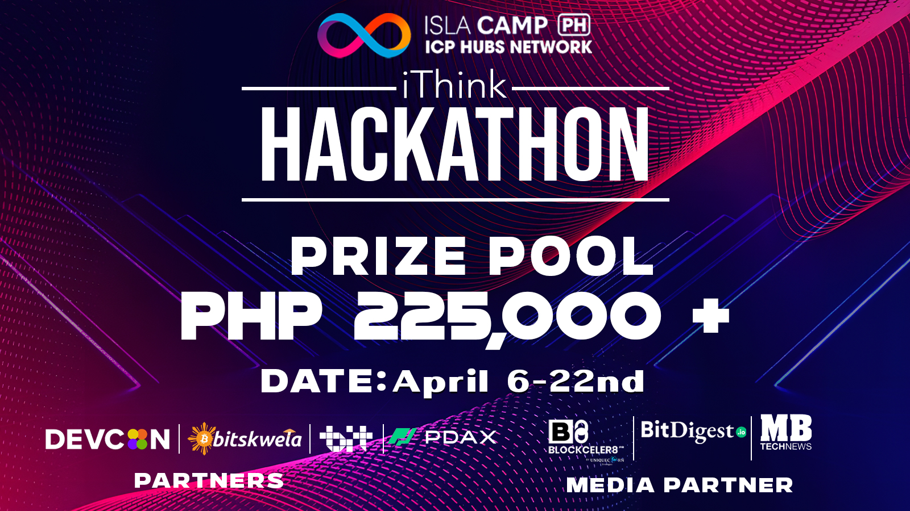

# 💫 iThink-hackathon
#### iThink Hackathon by ICP HUB Philippines "Push to the Limits” – A nationwide #Web3 Philippine Hackathon By Blockseblock

 

## [Introduction](#introduction) 

### 🧊 Team Name: [Artificial Ledger](https://www.youtube.com/watch?v=dQw4w9WgXcQ)  🇵🇭 
### 🕵️ Team Member:  
* ####  [Jay Arre Talosig](https://github.com/flexycode) 
* ####  [Emil John Llanes](https://github.com/0CottonBuds)      
* ####  [Spencer Jireh Cebrian](https://github.com/spencerjirehcebrian)    
* ####  [Luisryan Sanisit](https://github.com/Yisaaaa) 
  
### Description:   
#### "Push to the Limits” – A nationwide #Web3 Philippine Hackathon 🚀

* Brought you by ISLA Camp (ICP HUB Philippines)
* The applications are open to developers and teams based in the Philippines who are:
* Willing to build projects in Web3
* Willing to build projects on the Internet Computer Protocol
* Competitive enough to be the Top 3 on a Php 225,000 pool prize
* Looking to be incubated by ISLA Camp (ICP HUB Philippines) and jumpstart their journey into blockchain and Web3
* Looking to get funding via Grants 

##### Why Join? 

* Your chance to showcase your talent and skills in coding and contribute to Web3 and the Internet Computer Protocol.
* Be able to be incubated and get further funding via Grants on top of the pool prize.
* Be recognized globally and open up your ideas to a larger audience specifically Top VCs, Known Founders of the Web3 ecosystem, and Top Project builders

#### Eligibility Criteria 🚀 

* Must not have received a grant from the DFINITY Foundation on the submitted project
* Must not have received a grant from other Blockchain Foundations in the past 6-months
* Must not have received any funding or investment on the project they wish to submit
Ideally, the project should be unique to the Internet Computer Protocol
* Should be a resident of the Philippines
* Must have members over the age of 18
* Must complete registration before deadline

#### ```What to submit?``` (at the end of the hackathon – subject to change based on progression)

* Project description or pitch deck  
* Project logo
* Project deployed to Mainnet 
* Open-source Project repository (Github)
* Canister ID
* README (here is a good [(example)](https://github.com/dfinity/grant-rfps/blob/main/repo-checklist.md#blue_book-create-an-informative-readme) 
* Video (around 5-minutes)
* Should include an overview of project and features
* Must include a demonstration of your project

#### Workshop structure:  

1. There will be 5 workshops that will run throughout the duration of the hackathon. Participants are encouraged to attend. 

2. The workshop is entirely online, free of charge, and open to anyone interested in blockchain, smart contracts, and the Internet Computer Protocol.

3. No prior experience is necessary, making it an ideal learning platform for beginners and experienced developers alike.

4. Stay connected and get the latest updates by following ICP HUB Philippines Twitter, Facebook, and Telegram. 

5. Knowledge of TypeScript and Node.js and text editor is an advantage. Visual Studio Code is recommended due to its excellent support for TypeScript and Node.js development, but feel free to use a text editor of your choice.

6. If you're new to TypeScript or Node.js, consider going through basic tutorials for both.


#### Workshop Schedules: 

1. Workshop #1 - April 8 (Monday)

Topic: Introduction to ICP

2. Workshop #2 - April 9 (Tuesday) 

Topic: Introduction to building with Azle

3. Workshop #3 - April 10 (Wednesday) 

Topic: Why and how to build a project on the Internet Computer?

4. Workshop #4 - April 11 (Thursday)

Topic: Deploy First TypeScript Project

5. Workshop #5 - April 12 (Friday)

Topic: Doubt Clearing and Deploy Project on ICP

### Track:  
1. Main Track: BLUE SKIES TRACK – 
* New to smart contracts?
* Leverage the unique superpowers of the Internet Computer to build an awesome project that can solve real-world problems.
* For inspiration, check out the Request for [Startups](https://github.com/dfinity/grant-rfps/blob/main/requests-for-startups.md), but don’t feel restricted by our limited imagination.  
* Don't miss your chance to shape the future of web3 and create a legacy

### Prizes:

  ##### Philippine peso - (₱) 

* 3rd (50000)
* 2nd (75000)
* 1st (100000)

Php 225,000 + Php 2,500 Gcash to the first 10 registrations with at least 3 team invites


### Rules:
Before reading the Rules of this Challenge, we kindly advise you to check our General User Terms & Conditions and Privacy Policy of the Blockseblock platform.

#### 1. Organizations
* The hackathon shall take place online from April6, 2024 to April 30, 2024 via the blockseblock website. Registrations start on March 25, 2024 and ends on 6th April,2024
* ISLA Camp (ICP HUB Philippines) shall be considered as the organizer of the hackathon challenge with the support of Blockseblock team
#### 2. Conditions for entering the hackathon
1. The hackathon is free to join for all
2. The participants must abide with the eligibility criteria set at the hackathon description 
3. The delivery of the prize will be conditional upon the capacity of the participant to meet the hackathon description stated
4. There is only one entry per team in the hackathon
5. Any participants/ teams who doesn’t abide by the terms of the Rules during his/her Registration and at any time during the Hackathon will be automatically and without previous
6. notification, disqualified from the Challenge and shall not be awarded any Prize. In the case where a Prize would have been given to a Participant and/or Team who doesn’t or didn’t comply with the Rules at the time of his/her Registration or during the Hackathon, the Organizer has the discretionary right to demand the return of the Prize received.
7. The Organizer reserves the right to disqualify, immediately and without compensation, every Participants and/or Projects not satisfying in full with the Rules.
8. The Organizer reserves the right to modify at any time the terms of the Rules, and during the Hackathon without the requirement of notification to the Participants, concerning the application and the validity of these modifications. The Participants is encouraged to consult regularly the Rules. The Participant gives up expressly any complaint or contesting linked to any modification brought to the Rules by the Organizer. The Organizer reserves the right to cancel, shorten, suspend the Challenge without prior notice:
9. The Organizer reserves the right to cancel, shorten, suspend the Challenge without prior notice:
* In cases of unforeseen circumstances;
* If it appears that fraud has occurred in any form whatsoever
10.The Organizer cannot be held responsible for cancellation or suspension of the Hackathon.

#### 3.Eligibility: Projects must have backend built exclusively on the Internet Computer Protocol (ICP) to qualify.

# Judging criteria:
• Impact: Desirability for the Internet Computer Blockchain ecosystem.

• Business Value: Potential financial success and marketability.

• Communication: Clear conveyance of features, problems addressed, and benefits.

• Innovation: Fresh approach, unique problem-solving, or redefining solutions.

• ICP Technical Implementation: Exemplary use of Internet Computer's features.

### Important Source and documentation:

1. [Internetcomputer.org](https://internetcomputer.org/docs/current/developer-docs/developer-tools/dev-tools-overview?fbclid=IwAR3jhVUazB7FPLd3P-v9-YOM0MEpt5mQgY1aW0g00CPdiNHbIEvBFI26K18_aem_AU8K0_FAA4sipGzakyU1zjTb1R67_F8D5LNdvJ8eXr2yVNo4-QcCuIDKUXkODgQAKi6Jr6LgOHe3Ty2AyKmf3JEX) 

2. [Dfinity](https://github.com/dfinity/grant-rfps/blob/main/requests-for-startups.md)

3. [ICPHubPH](https://github.com/ICPHubPH)

4. [Blockseblock](https://blockseblock.com/hackathon) 

### Brainstorming Ideas


### Tech Stacks

* TypeScript 


#### [Back to Table of Content](#introduction)


